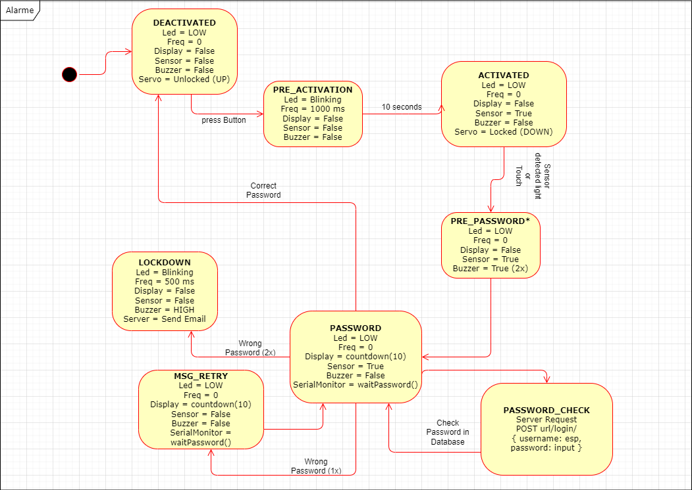

# Projeto 2 - ESP32 - Cliente/Servidor - Alarme

**Disciplina**: Prototipagem de Circuitos

**Integrantes**: Bruno Pinheiro, Cinthya Camila, Douglas Cardins

## Instalação do Servidor
Para execução correta do projeto, foi utilizado o `Poetry` para gerenciamento de dependências. Para instalar o Poetry, siga as instruções no [site oficial](https://python-poetry.org/docs/). Além disso, é recomendado ter o [`pyenv`](https://pyenv-win.github.io/pyenv-win/) instalado como gerenciador de versões do Python.

Utilizando o `pyenv`, instale a versão do python utilizada no projeto:

```shell
pyenv install 3.11.9
```

Após a instalação da versão python, determine a versão utilizada no repositório do projeto:

```shell
pyenv local 3.11.9
```

Em seguida, inicie o ambiente correto com o Poetry:

```shell
poetry shell
```

e instale as dependências com o comando:

```shell
poetry install
```

Siga os passos do tópico [Configuração do `.env`](#configuração-do-env) para configurar o arquivo `.env`.

Por fim, execute o projeto com o comando:

```shell
task run
```

## Configuração do `.env`
Seguindo o exemplo do arquivo `.env.example`, crie um arquivo `.env` na raiz do projeto com as seguintes variáveis:

- APP_NAME: Nome da aplicação
- USER_MAIL: E-mail utilizado pelo `ESP32` para envio de e-mails
- USER_PASSWORD: Senha do e-mail
- MAIL_TO: E-mail de destino

É importante ressaltar que o servidor está configurado para utilizar o `Gmail` como serviço de envio de e-mails. Caso deseje utilizar outro serviço, é necessário alterar o `SMTP` no arquivo `src/server/mail/mail_to.py`.

## Máquina de Estados
O ESP32 foi programado para funcionar com uma máquina de estados, seguindo o diagrama abaixo:


